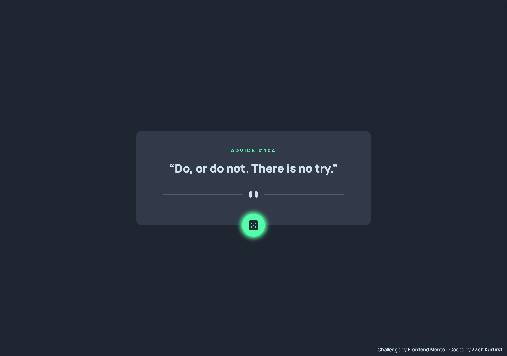

# Advice Generator App

Hello there! Welcome to my solution to the [Advice generator challenge on Frontend Mentor](https://www.frontendmentor.io/challenges/advice-generator-app-QdUG-13db "Advice Generator App challenge").

## Table of contents

- [Overview](#overview)
  - [The challenge](#the-challenge)
  - [Screenshot](#screenshot)
  - [Links](#links)
- [My process](#my-process)
  - [Built with](#built-with)
  - [What I learned](#what-i-learned)
  - [Continued development](#continued-development)
  - [Useful resources](#useful-resources)
- [Author](#author)
- [Acknowledgments](#acknowledgments)

## Overview

### The challenge

- View the optimal layout for the app depending on their device's screen size
- See hover state when hovering over dice icon
- Generate a new piece of advice by clicking the dice icon

### Screenshot



### Links

- [View live site](https://zachkurfirst-advice-generator.vercel.app/ "Advice Generator by Zach Kurfirst")
- [View solution on Frontend Mentor](https://www.frontendmentor.io/solutions/advice-generator-using-vanilla-javascript-asyncawait-udOKpps7KI "Frontend Mentor | Advice Generator using Vanilla JavaScript (async/await) coding challenge solution")

## My process

### Built with

- [Advice Slip JSON API](https://api.adviceslip.com/ "Advice Slip JSON API")
- Semantic HTML5 markup
- [Tailwind](https://tailwindcss.com/ "Tailwind CSS - Rapidly build modern websites without ever leaving your HTML.") - CSS framework
- Vanilla JavaScript
- [Vercel](https://vercel.com/ "Vercel website") - Deployment

### What I learned

During this project, I learned a few cool CSS properties such as box shadow and rotate (for the dice icon hover state effect), and I recognized a use-case for using negative margins (to position the dice icon halfway overlapping the advice container and the background).

Below is a snippet from the `index.html` for the dice icon button. (Note: I've removed other Tailwind CSS utility classes to specifically call out the classes related to the hover effect and positioning)

```html
<button
  class="shadow-[0_0_10px_4px_rgba(0,0,0,0.2)] hover:shadow-neon-green hover:transition-all hover:rotate-90 hover:duration-300 -mb-7">
  
</button>
```

In the past, I've typically used third-party API's when working with web frameworks such as React. In this challenge, I was working in vanilla JS, so it was interesting to see how you can render API data via DOM manipulation.

Below are the two functions that fetch and render the `id` and `advice` from the advice API. (Note: I've removed the button styling aspects of the function to specifically call out the API interaction)

```js
const fetchAdvice = async () => {
  const response = await fetch(URL);
  const data = await response.json();
  const advice = data.slip;
  renderAdvice(advice);
};

const renderAdvice = async (adviceSlip) => {
  const { id, advice } = adviceSlip;
  adviceNumber.textContent = id;
  adviceQuote.textContent = advice;
};
```

### Continued development

I want to continue engaging projects that require working with third-party API's and continue to build on my existing knowledge of how to fetch and render this data in different environments.

### Useful resources

- [Tailwind CSS Documentation](https://tailwindcss.com/docs/installation "Installation - Tailwind CSS")
- [Vercel Deployment Documentation](https://vercel.com/docs/deployments/overview "Deploying to Vercel")
- [CSS Reference: box-shadow](https://cssreference.io/property/box-shadow/ "box-shadow - CSS Reference")
- [Tutorials Point: How to disable button element dynamically using JavaScript?](https://www.tutorialspoint.com/how-to-disable-button-element-dynamically-using-javascript "How to disable button element dynamically using JavaScript?")
- [Digital Ocean: How To Modify Attributes, Classes, and Styles in the DOM](https://www.digitalocean.com/community/tutorials/how-to-modify-attributes-classes-and-styles-in-the-dom#modifying-classes "How To Modify Attributes, Classes, and Styles in the DOM  | DigitalOcean" )

## Author

- Website - [zachkurfirst.com](https://zachkurfirst.com "Zach Kurfirst portfolio")
- Frontend Mentor - [@zachkurfirst](https://www.frontendmentor.io/profile/zachkurfirst "Zach Kurfirst Frontend Mentor profile")

## Acknowledgments

- [YouTube Tutorial from Seer Studio (Grizhlie Codes)](https://www.youtube.com/watch?v=SjjmHNdE32Y "YouTube video: Advice Generator App - Frontend Mentor - Learn Async Await, Fetch and Promises - HTML, CSS, JS")
